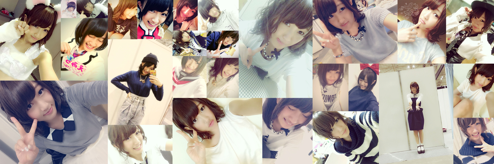

# えみちの画像 一気に保存します!（メンバーのGoogle+の画像 一気に保存しちゃいます！）

## 一気に保存します！
NMB48 TeamBⅡ 上枝恵美加こと__えみちの画像保存用プログラムです__（AKB48Gメンバー用の画像保存プログラムです）。Google+IDを元に画像を出来る限り全件取得します。
## 最新バージョン
バージョン__1.7.2__ アナリティクス追加
## 使い方
1. GitHubからクローンまたはダウンロード
2. 仮想環境（XAMPPなど）のhtdocsなどに入れる
3. localhostなどで動かす
4. Google+のID（各メンバーのURLからコピペしてください。但し、一部メンバーはURLから取得できないのでソースから頑張って取得してください）
5. オプションを選択（詳細はオプションを見てください）
6. 実行！（相当時間がかかります）
7. imagesフォルダ内のメンバー名のフォルダが作成され、そこに保存されます

## 保存オプション
###保存する投稿時期（_通常_･古い･もっと古い）
投稿が多いと全件取得できない時があります。その時は古い写真を取得するなどを選択してみてください。
### Picasaアルバムの取得（_する_･しない）
Google+APIではアルバムが取得できません。アルバムも取得したい場合はPicasaの取得もしてください。（Picasaアルバム取得時の注意も御覧ください）

## Picasaアルバム取得時の注意
Picasaアルバム取得を選択された場合はGoogle+の写真も取得するため、_一部画像が重複して画像が保存されます_。ご注意ください。
## 注意事項
* メンバーの投稿数によりますが多くの画像を取得します。相当な時間と負荷がかかりますのでご注意ください。
* 一度に全件取得できない場合があります。その際はオプションの設定を変更し、何度か取得してみてください。
* 多くの画像を取得するためGoogleからコードの入力を求められる場合があります
* 必ず最新版をご利用ください（ReadmeのTOPとindex.php左下に記載しています）

## 現状の問題点（他にもあったら教えて下さい）
* 重複して画像が保存される
* 途中で処理が止まる時がある
* APIリクエストの負担軽減

## 今後改善予定
* APIキーは各自入力へ
* 重複写真の削除
